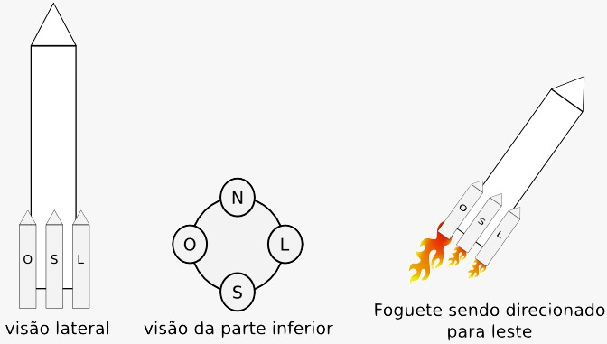

**ToDo** - Substitua essa linha pelo seu Nome e Sobrenome

### Programação Orientada a Objetos - POO29004

#### Engenharia de Telecomunicações

##### Instituto Federal de Santa Catarina

# Sistema de controle de foguetes

Faça um projeto para simular um sistema de controle de foguetes. No exemplo da figura abaixo tem-se um foguete com 4 propulsores, identificados como Norte, Sul, Leste e Oeste. 

## Regras para o sistema de controle

- Em uma base de lançamento podem existir 1 ou mais foguetes e o centro de controle poderá fazer o lançamento de qualquer um dos foguetes.
- Cada foguete possui um tanque único de combustível e quatro propulsores. Porém, o quantidade de combustível (em litros) que cabe em cada tanque pode ser diferente para cada tipo de foguete. 
- Todos os propulsores de um mesmo foguete possuem um consumo idêntico de combustível (litros/segundos), porém é possível que propulsores em foguetes diferentes possuam um consumo diferente.
- Todos os propulsores de um mesmo foguete possuem uma mesma força de empuxo, de forma que um propulsor estando com 100% de sua potência conseguirá um empuxo capaz de empurrar 25% do peso do foguete. Para o lançamento vertical de um foguete é necessário que o empuxo inicial seja maior que o peso total do foguete. Ou seja, para o lançamento de um foguete é necessário que todos os propulsores usem 100% de sua potência por pelo menos 1 minuto. Após esse período, qualquer potência entre 50% e 100% para cada propulsor fará com que o foguete continue subindo (Essa simplificação foi feita para facilitar a implementação.).
- Cada propulsor pode ter sua potência definida com um valor de 0 a 100%. Se um propulsor estiver com potência 0, então esse estará consumindo 0 de combustível. Se a potência estiver em 50%, então esse estará consumindo 50% daquilo que fora definido como seu consumo. 
- O centro de controle poderá fazer a telemetria do foguete. Por exemplo, saber qual seu nível de combustível atual, sua altitude e a potência de cada um dos seus propsulsores.
- A mudança de direção de um foguete pode ser feita alterando a potência de seus propulsores por um intervalo de tempo específico (de 1 segundo a 10 segundos). Por exemplo, para o foguete ser direcionado para o leste é necessário que a potência do motor Oeste seja maior que a potência dos demais propulsores por um período de 5 segundos. Depois desse intervalo, todos propulsores voltam a ficar com a mesma potência. Pode-se ainda optar por diminuir a potência do propulsor Leste caso o propulsor Oeste já esteja em sua potência máxima.
- Para efeitos de simplificação, após o lançamento do foguete, o mesmo só consumirá combustível durante suas mudanças de direção. Ou seja, se o foguete não se movimentar, seu nível de combustível não será alterado.

## Com base no detalhamento acima, faça:

1. Identifique as classes necessárias e desenhe um diagrama de classes UML representando as classes e associações entre essas. Para cada classe é necessário indicar todos os atributos e somente os métodos essenciais para entendimento da classe
  1. O diagrama deverá ser entregue como uma figura PNG. Na raiz do repositório deve-se criar um arquivo [Resolucao.md](Resolucao.md) e fazer nesse uma referência para a figura do diagrama
2. Desenvolva um aplicativo Java (p. ex. Classe `Principal` com método `main`) com um menu interativo que permita ao usuário realizar as seguintes operações:
   1. Configurar base de lançamento
      1. O usuário deverá informar o número de foguetes que serão criados, bem como as características de cada foguete.
   2. Fazer lançamento
      1. O usuário poderá indicar qual foguete será lançado. 
   3. Fazer a mudança de direção de um foguete
      1. O usuário poderá alterar a direção de qualquer foguete que já fora lançado anteriormente
   4. Imprimir telemetria do foguete
      1. O usuário poderá imprimir todas informações de telemetria para um foguete específico, lançado ou não.
   5. Sair do programa